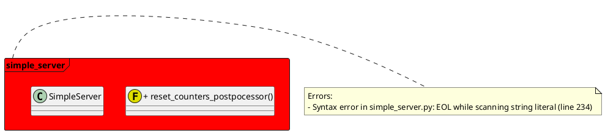
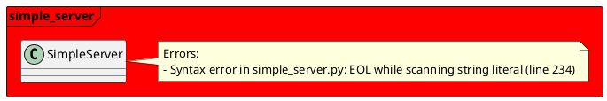

# PlantUML Notes Syntax Specification

## Overview
This document contains the correct syntax for using notes in PlantUML diagrams, based on testing and validation.

## Key Rules

### 1. Notes MUST be attached to specific elements
- Notes cannot exist standalone inside packages
- Notes must be attached using `note [position] of "element_name"`
- Element names must match exactly (case-sensitive)

### 2. Supported Note Types

#### Standard Notes
```plantuml
note right of "element_name"
Multi-line note content:
- First item
- Second item
end note

note right of "element_name" : Single line note
```

#### Rectangular Notes (rnote)
```plantuml
rnote right of "element_name"
Rectangular note content:
- First item
- Second item
end rnote
```

#### Hexagonal Notes (hnote)
```plantuml
hnote right of "element_name"
Hexagonal note content:
- First item
- Second item
end hnote
```

**Note**: `rnote` and `hnote` syntax may vary by PlantUML version. Use standard `note` for maximum compatibility.

### 3. Note Positions
- `left of` - note appears to the left of element
- `right of` - note appears to the right of element
- `over` - note appears over element
- `over element1, element2` - note spans multiple elements

### 4. Colors
```plantuml
note right of "element_name" #FFAAAA
Colored note content
end note
```

## Common Mistakes

### ❌ WRONG - Notes inside packages without element attachment
```plantuml
package "MyPackage" {
  note right : This will NOT work
  class MyClass {}
}
```

### ❌ WRONG - Incorrect closing tags
```plantuml
rnote right of "element"
content
endrnote  # Should be "end rnote"
```

### ✅ CORRECT - Notes attached to elements
```plantuml
package "MyPackage" {
  class MyClass {}
  
  note right of "MyClass"
  This works correctly:
  - Item 1
  - Item 2
  end note
}
```

### ✅ CORRECT - Notes outside packages
```plantuml
package "MyPackage" {
  class MyClass {}
}

note right of "MyPackage"
Package-level note:
- Works outside package
- Attached to package element
end note
```

## Tested Examples

### Example 1: Package-level note (outside package)


### Example 2: Class-level note (inside package)


## Validation
All examples in this document have been tested with PlantUML and generate valid diagrams.

## Last Updated
September 17, 2024
