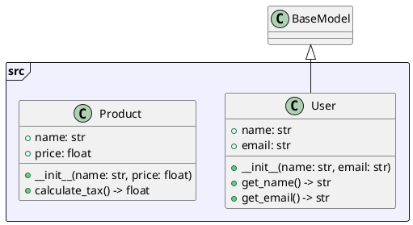

# py2puml - UML Generator for Python

[](https://www.python.org/downloads/)
[](LICENSE)
[](tests/)

**py2puml** is a powerful tool for automatic generation of UML diagrams from Python source code. The parser analyzes the structure of classes, methods, attributes, and their relationships, creating accurate PlantUML diagrams.

## 🚀 Features

- **Comprehensive Python code analysis**: Parses classes, methods, attributes, and global variables
- **PlantUML diagram generation**: Automatically creates UML diagrams in standard format
- **File description feature**: Analyze and describe individual Python files with detailed output
- **Multiple output formats**: Support for text, JSON, and YAML output formats
- **Documentation extraction**: Extract and display docstrings from classes, methods, and functions
- **Inheritance support**: Correctly displays class hierarchies
- **Visibility management**: Distinguishes public, protected, and private class members
- **Robust error handling**: Handles invalid code and filesystem issues gracefully
- **Visual error marking**: Files with errors are highlighted in red in UML diagrams
- **Partial parsing**: Can process files with syntax errors
- **Type hint support**: Analyzes type hints and annotations
- **Modern CLI architecture**: Command-based interface with clear separation of concerns

## 📊 Example

```bash
# Command to generate this diagram
py2puml generate . py2puml.puml
```


## 📋 Requirements

- Python 3.8+
- pathspec>=0.11.0 (for .gitignore pattern support)
- PyYAML>=6.0 (for YAML output format)

## 🛠️ Installation

### Clone the repository
```bash
git clone https://github.com/your-username/py2puml.git
cd py2puml
```

### Install dependencies
```bash
# Create a virtual environment
python -m venv venv
source venv/bin/activate  # Linux/Mac
# or
venv\Scripts\activate     # Windows

# Install in development mode
pip install -e .
```

## 🚀 Quick Start

### Basic usage

**Generate UML diagram from directory:**
```bash
py2puml generate ./my_python_project ./output/uml_diagram.puml
```

**Describe a single Python file:**
```bash
py2puml describe ./src/models.py
```

### Multiple ways to run

**After installation (recommended):**
```bash
py2puml generate src/ output.puml
py2puml describe src/models.py
```

**Direct execution:**
```bash
python cli_direct.py generate src/ output.puml
python cli_direct.py describe src/models.py
```

### File description feature

**Describe with JSON output:**
```bash
py2puml describe ./src/models.py --format json
```

**Describe with YAML output:**
```bash
py2puml describe ./src/models.py --format yaml
```

**Describe without documentation:**
```bash
py2puml describe ./src/models.py --no-docs
```

**Combine options:**
```bash
py2puml describe ./src/models.py --format json --no-docs
```

### Advanced usage

**Generate without .gitignore filtering:**
```bash
py2puml generate ./src/ ./output/diagram.puml --no-gitignore
```

**Generate with explicit .gitignore usage:**
```bash
py2puml generate ./src/ ./output/diagram.puml --use-gitignore
```

## 📖 Usage Examples

### Analyze a single file
```bash
py2puml describe ./src/models.py
```

**Output:**
```
File: ./src/models.py
Summary: 45 lines, 3 classes, 2 functions, 1 variables

Classes:
  User (class)
    Bases: BaseModel
    Methods:
      public + __init__(name: str, email: str)
      public + get_name() -> str
      public + get_email() -> str

  Product (class)
    Methods:
      public + __init__(name: str, price: float)
      public + calculate_tax() -> float

Functions:
  public + create_user(name: str, email: str) -> User

Variables:
  public DEFAULT_SETTINGS
```

### Analyze with JSON output
```bash
py2puml describe ./src/models.py --format json
```

**Output:**
```json
{
  "file": "./src/models.py",
  "summary": {
    "lines": 45,
    "classes": 3,
    "functions": 2,
    "variables": 1
  },
  "classes": [
    {
      "name": "User",
      "type": "class",
      "bases": ["BaseModel"],
      "methods": [
        {
          "name": "__init__",
          "visibility": "public",
          "signature": "+ __init__(name: str, email: str)"
        }
      ]
    }
  ]
}
```

### Generate UML diagram
```bash
py2puml generate ./src/ ./output/diagram.puml
```

**Generated PlantUML:**


## 🔧 Development

### Running tests
```bash
python -m pytest
```

### Running with coverage
```bash
python -m pytest --cov=core --cov=utils
```

### Development installation
```bash
pip install -e .
```

## 📝 Features in Detail

### Class Analysis
- **Inheritance**: Detects and displays class hierarchies
- **Methods**: Analyzes method signatures with type hints
- **Attributes**: Identifies class attributes and their types
- **Visibility**: Distinguishes public (+), protected (#), and private (-) members
- **Documentation**: Extracts and displays docstrings

### Function Analysis
- **Global functions**: Analyzes functions outside classes
- **Type hints**: Processes parameter and return type annotations
- **Documentation**: Extracts function docstrings
- **Visibility**: All global functions are considered public

### Error Handling
- **Syntax errors**: Gracefully handles files with syntax errors
- **Import errors**: Continues processing despite import issues
- **File system errors**: Handles permission and access issues
- **Visual feedback**: Files with errors are marked in red in UML diagrams

### Output Formats
- **Text**: Human-readable format with detailed information
- **JSON**: Structured data for programmatic processing
- **YAML**: Alternative structured format
- **PlantUML**: Standard UML diagram format

## 🤝 Contributing

1. Fork the repository
2. Create a feature branch (`git checkout -b feature/amazing-feature`)
3. Commit your changes (`git commit -m 'Add amazing feature'`)
4. Push to the branch (`git push origin feature/amazing-feature`)
5. Open a Pull Request

## 📄 License

This project is licensed under the MIT License - see the [LICENSE](LICENSE) file for details.

## 🙏 Acknowledgments

- [PlantUML](http://plantuml.com/) for the UML diagram format
- [Click](https://click.palletsprojects.com/) for the CLI framework
- [pathspec](https://github.com/cpburnz/python-pathspec) for .gitignore pattern support