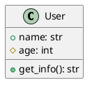
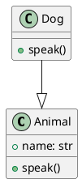

# py2puml - UML Generator for Python

[](https://www.python.org/downloads/)
[](LICENSE)
[](tests/)

**py2puml** is a powerful tool for automatic generation of UML diagrams from Python source code. The parser analyzes the structure of classes, methods, attributes, and their relationships, creating accurate PlantUML diagrams.

## 🚀 Features

- **Comprehensive Python code analysis**: Parses classes, methods, attributes, and global variables
- **PlantUML diagram generation**: Automatically creates UML diagrams in standard format
- **File description feature**: Analyze and describe individual Python files with detailed output
- **Multiple output formats**: Support for text, JSON, and YAML output formats
- **Documentation extraction**: Extract and display docstrings from classes, methods, and functions
- **Inheritance support**: Correctly displays class hierarchies
- **Visibility management**: Distinguishes public, protected, and private class members
- **Robust error handling**: Handles invalid code and filesystem issues gracefully
- **Visual error marking**: Files with errors are highlighted in red in UML diagrams
- **Partial parsing**: Can process files with syntax errors
- **Type hint support**: Analyzes type hints and annotations

## 📊 Example

```bash
# Command to generate this diagram
python main.py . py2puml.puml
```


## 📋 Requirements

- Python 3.8+
- pathspec>=0.11.0 (for .gitignore pattern support)

## 🛠️ Installation

### Clone the repository
```bash
git clone https://github.com/your-username/py2puml.git
cd py2puml
```

### Install dependencies
```bash
# Create a virtual environment
python -m venv venv
source venv/bin/activate  # Linux/Mac
# or
venv\Scripts\activate     # Windows

# Install development dependencies
pip install -r requirements.txt
```

## 🚀 Quick Start

### Basic usage
```bash
python main.py ./my_python_project ./output/uml_diagram.puml
```

### File description feature

**Describe a single Python file:**
```bash
python main.py --describe-file ./src/models.py
```

**Describe with JSON output:**
```bash
python main.py --describe-file ./src/models.py --format json
```

**Describe with YAML output:**
```bash
python main.py --describe-file ./src/models.py --format yaml
```

**Describe without documentation:**
```bash
python main.py --describe-file ./src/models.py --no-docs
```

**Combine options:**
```bash
python main.py --describe-file ./src/models.py --format json --no-docs
```

### Usage examples

**Analyze a single file:**
```bash
python main.py ./src/models.py ./output/models.puml
```

**Analyze an entire project:**
```bash
python main.py ./my_project ./output/project_uml.puml
```

**Create an SVG diagram:**
```bash
# Generate PlantUML file
python main.py ./my_project ./output/diagram.puml

# Convert to SVG (requires PlantUML)
plantuml -tsvg ./output/diagram.puml
```

### Gitignore Support

The tool supports `.gitignore` patterns to exclude files from UML generation:

```bash
# Use .gitignore patterns (default)
python main.py ./my_project ./output/diagram.puml

# Disable .gitignore patterns
python main.py --no-gitignore ./my_project ./output/diagram.puml
```

#### Examples

**Basic .gitignore:**
```
__pycache__/
*.pyc
venv/
```

**Advanced .gitignore:**
```
# Ignore test files
tests/
*_test.py

# Ignore generated files
*.pyc
__pycache__/

# Ignore virtual environments
venv/
.venv/
```

The tool automatically finds all `.gitignore` files in the project and applies their patterns relative to each file's location, just like Git does.

## 📝 File Description Feature

The `--describe-file` command provides detailed analysis of individual Python files, extracting classes, functions, variables, and their documentation.

### Output Formats

**Text format (default):**
```
File: example.py
Summary: 45 lines, 3 classes, 2 functions, 3 variables

Classes:
  UserAuthenticator (abstract class)
    Bases: ABC
    Documentation: Abstract base class for user authentication.
    Methods:
      + __init__(self, config: Dict[str, str])
        Documentation: Initialize authenticator with configuration.
      + {abstract} authenticate(self, username: str, password: str) -> bool
        Documentation: Authenticate user credentials.

Functions:
  + create_user(username: str, email: str) -> User
    Documentation: Create a new user instance.

Variables:
  + API_VERSION: str
  + DEFAULT_TIMEOUT: int
```

**JSON format:**
```json
{
  "file": "example.py",
  "summary": {
    "lines": 45,
    "classes": 3,
    "functions": 2,
    "variables": 3
  },
  "classes": [
    {
      "name": "UserAuthenticator",
      "type": "abstract class",
      "bases": ["ABC"],
      "documentation": "Abstract base class for user authentication.",
      "fields": [],
      "methods": [
        {
          "name": "__init__",
          "visibility": "public",
          "signature": "__init__(self, config: Dict[str, str])",
          "return_type": null,
          "documentation": "Initialize authenticator with configuration."
        }
      ]
    }
  ],
  "functions": [
    {
      "name": "create_user",
      "signature": "create_user(username: str, email: str)",
      "return_type": "User",
      "documentation": "Create a new user instance."
    }
  ],
  "variables": [
    {
      "name": "API_VERSION",
      "visibility": "public",
      "type": "str",
      "documentation": null
    }
  ]
}
```

**YAML format:**
```yaml
file: example.py
summary:
  lines: 45
  classes: 3
  functions: 2
  variables: 3
classes:
  - name: UserAuthenticator
    type: abstract class
    bases: [ABC]
    documentation: Abstract base class for user authentication.
    fields: []
    methods:
      - name: __init__
        visibility: public
        signature: __init__(self, config: Dict[str, str])
        return_type: null
        documentation: Initialize authenticator with configuration.
```

### Supported Features

- **Class analysis**: Extracts class names, bases, documentation, fields, and methods
- **Function analysis**: Extracts function signatures, documentation, and return types
- **Variable analysis**: Extracts global variables and their types
- **Documentation extraction**: Extracts docstrings from classes, methods, and functions
- **Visibility detection**: Identifies public, protected, and private members
- **Async support**: Handles async functions and methods
- **Type annotations**: Extracts type hints and annotations
- **Error handling**: Gracefully handles syntax errors and missing files

### Command Options

- `--describe-file <file_path>` - Path to the Python file to analyze
- `--format {text,json,yaml}` - Output format (default: text)
- `--no-docs` - Exclude documentation from output

## �� API Documentation

### UMLGenerator

The main class for generating UML diagrams.

#### Constructor
```python
UMLGenerator(directory_path: str)
```
- `directory_path` - path to the directory with Python files

#### Main methods

**generate_uml() -> str**
Generates PlantUML code for all Python files in the directory.

**describe_file(file_path: Path, format: str = 'text', include_docs: bool = True) -> str**
Describes a single Python file with detailed analysis.
- `file_path` - path to the Python file to analyze
- `format` - output format: 'text', 'json', or 'yaml'
- `include_docs` - whether to include documentation in output
- Returns formatted string with file analysis

**parse_python_file(file_path: Path) -> tuple**
Parses a single Python file, returning a tuple with classes, functions, global variables, and base classes.

**visibility(name: str) -> tuple**
Determines the visibility of a class member by its name:
- `__name__` → `~` (magic/private)
- `__name` → `-` (private)
- `_name` → `#` (protected)
- `name` → `+` (public)

### CLI Interface

```bash
python main.py <input_directory> <output_file> [options]
# or
python main.py --describe-file <file_path> [options]
```

**Arguments:**
- `input_directory` - path to the directory with Python files (for UML generation)
- `output_file` - path to the output file for saving PlantUML code (for UML generation)
- `--describe-file <file_path>` - path to a single Python file to describe

**Options for UML generation:**
- `--use-gitignore` - use .gitignore patterns to exclude files (enabled by default)
- `--no-gitignore` - disable .gitignore pattern usage

**Options for file description:**
- `--format {text,json,yaml}` - output format for describe-file command (default: text)
- `--no-docs` - exclude documentation from describe-file output

## 🏗️ Architecture

### Project structure
```
py2puml/
├── main.py              # CLI interface
├── uml_generator.py     # Main UML generation logic
├── tests/               # Test files
│   ├── unit/           # Unit tests
│   ├── integration/    # Integration tests
│   ├── functional/     # Functional tests
│   └── edge_cases/     # Edge case tests
├── pytest.ini          # pytest configuration
└── README.md           # Documentation
```

### Main components

1. **UMLGenerator** - main class for UML generation
2. **AST Parser** - Python AST parser for extracting structural information
3. **PlantUML Generator** - PlantUML syntax generator
4. **Error Handler** - error and warning handling system
5. **Error Visualization** - visual highlighting of files with errors

### Workflow

1. **Directory scan** - find all `.py` files
2. **AST parsing** - analyze the structure of each file
3. **Information extraction** - classes, methods, attributes, inheritance
4. **PlantUML generation** - create UML diagram
5. **Save result** - write to output file

## 🧪 Testing

### Running tests

```bash
# All tests
pytest

# By category
pytest -m unit          # Unit tests
pytest -m integration   # Integration tests
pytest -m functional    # Functional tests
pytest -m edge_cases    # Edge case tests

# With coverage
pytest --cov=uml_generator

# Specific file
pytest tests/unit/test_uml_generator.py
```

### Test structure

- **Unit Tests** (`tests/unit/`) - test individual components and methods
- **Integration Tests** (`tests/integration/`) - test CLI interface and file processing
- **Functional Tests** (`tests/functional/`) - test output format and PlantUML syntax
- **Edge Case Tests** (`tests/edge_cases/`) - test edge conditions and error handling

### Test coverage

The test suite covers:
- ✅ All public methods of UMLGenerator
- ✅ Error handling scenarios
- ✅ CLI argument processing
- ✅ Filesystem operations
- ✅ PlantUML output validation
- ✅ Edge cases and conditions

## 📝 Examples

### Simple class
```python
class User:
    def __init__(self, name: str, age: int):
        self.name = name
        self._age = age
    
    def get_info(self) -> str:
        return f"{self.name}, {self._age}"
```

Result:


### Inheritance
```python
class Animal:
    def __init__(self, name: str):
        self.name = name
    
    def speak(self):
        pass

class Dog(Animal):
    def speak(self):
        return "Woof!"
```

Result:


## 🚨 Error Visualization

### Marking files with errors

py2puml automatically detects and visually highlights files with errors in UML diagrams:

- **Red color**: Files with errors are shown in red (`#FF0000`)
- **Error comments**: List of errors is included in package comments
- **Special icon**: A special icon is used for problematic files

### Example PlantUML code for a file with errors

```plantuml
package "problematic_file" <<Frame>> #FF0000 {
  note right : Errors:
  note right : - Syntax error in line 15
  note right : - Permission denied
  class SomeClass {
    // class content
  }
}
```

### Types of handled errors

- **SyntaxError**: Invalid Python syntax
- **PermissionError**: No permission to read files
- **UnicodeDecodeError**: File encoding issues
- **General Exception**: Any other processing errors

### Accessing error information

```python
generator = UMLGenerator("./my_project")
uml_output = generator.generate_uml()

# List all errors
print(f"Total errors: {len(generator.errors)}")

# Files with errors
print(f"Files with errors: {generator.files_with_errors}")

# Specific file
if "path/to/file.py" in generator.files_with_errors:
    errors = generator.files_with_errors["path/to/file.py"]
    print(f"Errors in file: {errors}")
```

## 🔧 Troubleshooting

### Common issues

**Error: "Directory not found"**
```bash
# Make sure the directory path is correct
python main.py ./existing_directory ./output.puml
```

**Error: "Permission denied"**
```bash
# Check file permissions
chmod +r ./your_python_files
```

**Error: "Syntax error"**
- Files with syntax errors will be skipped
- Check logs for error details
- Files with errors are highlighted in red in the UML diagram

**Empty output file**
- Make sure there are `.py` files in the directory
- Check that files contain classes or functions

### Debugging

**Enable verbose output:**
```python
# Add debug info in code
generator = UMLGenerator("./my_project")
print(f"Found errors: {generator.errors}")
print(f"Files with errors: {generator.files_with_errors}")
```

**Check project structure:**
```bash
# Make sure the structure is correct
find ./my_project -name "*.py" -type f
```

## 🤝 Contributing

Contributions are welcome!

### How to contribute

1. **Fork** the repository
2. Create a **feature branch** (`git checkout -b feature/amazing-feature`)
3. **Commit** your changes (`git commit -m 'Add amazing feature'`)
4. **Push** to your branch (`git push origin feature/amazing-feature`)
5. Open a **Pull Request**

### Code standards

- Follow PEP 8
- Add tests for new features
- Update documentation as needed
- Use type hints

### Commit message structure

```
feat: add new feature
fix: fix bug
docs: update documentation
test: add tests
refactor: code refactoring
```

## 📄 License

This project is licensed under the MIT License. See the [LICENSE](LICENSE) file for details.

## 📞 Support

- **Issues**: [GitHub Issues](https://github.com/your-username/py2puml/issues)
- **Discussions**: [GitHub Discussions](https://github.com/your-username/py2puml/discussions)
- **Email**: your-email@example.com

## 🙏 Acknowledgements

- [PlantUML](http://plantuml.com/) - for a great UML diagram tool
- [Python AST](https://docs.python.org/3/library/ast.html) - for Python code parsing capabilities
- The Python community for inspiration and support

---

Instruction completed according to HOW TO DO tool