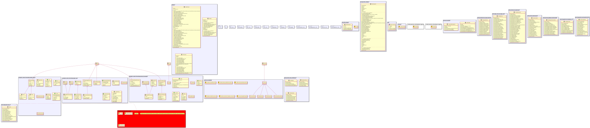

# py2puml — codebase structure for AI agents

[](https://www.python.org/downloads/)
[](LICENSE)
[](tests/)

**py2puml** gives an AI coding agent a map of an unfamiliar codebase. It analyzes
Python sources and returns the structure of classes, methods, attributes and their
relationships — as a PlantUML diagram for a human, or as JSON/YAML through an MCP
server for an agent. Instead of reading thousands of lines to find out what talks
to what, the agent asks for the structure once.

Not related to the `py2puml` package on PyPI — this is a separate implementation
built around agent tooling.

## 📋 Table of Contents

- [🚀 Features](#-features)
- [📊 Example](#-example)
- [📋 Requirements](#-requirements)
- [🛠️ Installation](#️-installation)
  - [Clone the repository](#clone-the-repository)
  - [Install dependencies](#install-dependencies)
  - [Install with MCP Server (Optional)](#install-with-mcp-server-optional)
- [🚀 Quick Start](#-quick-start)
  - [Basic usage](#basic-usage)
  - [Multiple ways to run](#multiple-ways-to-run)
  - [File description feature](#file-description-feature)
  - [Advanced usage](#advanced-usage)
- [📖 Usage Examples](#-usage-examples)
- [🔧 Development](#-development)
- [📝 Features in Detail](#-features-in-detail)
- [📄 License](#-license)

## 🚀 Features

- **Comprehensive Python code analysis**: Parses classes, methods, attributes, and global variables
- **PlantUML diagram generation**: Automatically creates UML diagrams in standard format
- **File description feature**: Analyze and describe individual Python files with detailed output
- **Multiple output formats**: Support for text, JSON, and YAML output formats
- **Documentation extraction**: Extract and display docstrings from classes, methods, and functions
- **Inheritance support**: Correctly displays class hierarchies
- **Visibility management**: Distinguishes public, protected, and private class members
- **Property access annotations**: Automatically detects and annotates Python properties with access levels (`{read write}`, `{read only}`, `{write only}`)
- **🎨 Custom class formatting**: Advanced styling system for different class types with background colors
  - **Regular classes**: Standard styling with default background
  - **Abstract classes**: `abstract` keyword with white background (`#FFFFFF`)
  - **Dataclasses**: `class` keyword with green background (`#90EE90`) - replaces `dataclass` keyword
  - **Interfaces**: `interface` keyword with white background (`#FFFFFF`)
  - **PlantUML syntax**: Uses `<< (C,#COLOR) >>` for proper background color rendering
- **🎯 Decorator handling**: Comprehensive support for Python decorators with intelligent display rules
  - **Class decorators**: Smart handling - `@dataclass` decorator excluded from class name (handled by styling)
  - **Method decorators**: Smart filtering based on decorator type
    - **Static methods**: `{static} method_name()` - `@staticmethod` excluded from name
    - **Class methods**: `method_name()` - `@classmethod` excluded from name  
    - **Abstract methods**: `{abstract} method_name()` - `@abstractmethod` excluded from name
    - **Property methods**: `property_name: type {access}` - getters/setters not displayed separately
    - **Custom decorators**: `method_name@decorator()` - user decorators preserved in name
- **Robust error handling**: Handles invalid code and filesystem issues gracefully
- **Visual error marking**: Files with errors are highlighted in red in UML diagrams
- **Partial parsing**: Can process files with syntax errors
- **Type hint support**: Analyzes type hints and annotations
- **Modern CLI architecture**: Command-based interface with clear separation of concerns
- **🎯 Standalone single-file script**: Complete functionality in one portable `py2uml.py` file - no installation required!
- **MCP Server integration**: Optional MCP (Model Context Protocol) server for enhanced IDE integration with Cursor

## 📊 Example

```bash
# Command to generate this diagram
py2puml generate . py2puml.puml
```



## 📋 Requirements

- Python 3.8+
- pathspec>=0.11.0 (for .gitignore pattern support)
- PyYAML>=6.0 (for YAML output format)

## 🛠️ Installation

### Clone the repository
```bash
git clone https://github.com/your-username/py2puml.git
cd py2puml
```

### Install dependencies
```bash
# Create a virtual environment
python -m venv venv
source venv/bin/activate  # Linux/Mac
# or
venv\Scripts\activate     # Windows

# Install in development mode
pip install -e .
```

### Install with MCP Server (Optional)

For enhanced IDE integration with Cursor, you can install the MCP (Model Context Protocol) server:

```bash
# Basic installation with MCP server
./install.sh --install-mcp

# Install with MCP server and configure Cursor
./install.sh --install-mcp --configure-cursor
```

The MCP server provides detailed Python file structure analysis to Cursor agent, enabling better code understanding and documentation generation.

## 🚀 Quick Start

### 🎯 Single-File Standalone Script (Recommended for Quick Use)

**The easiest way to use py2puml is with the standalone `py2uml.py` script:**

```bash
# Download just the py2uml.py file and use it immediately
python py2uml.py generate ./my_python_project ./output/uml_diagram.puml
python py2uml.py describe ./src/models.py
```

**Advantages of the standalone script:**
- ✅ **No installation required** - just download one file
- ✅ **No dependencies** - works with standard Python libraries
- ✅ **Portable** - can be shared and used anywhere
- ✅ **Complete functionality** - includes all features in one file
- ✅ **Self-contained** - no need for the full project structure

### Basic usage (after installation)

**Generate UML diagram from directory:**
```bash
py2puml generate ./my_python_project ./output/uml_diagram.puml
```

**Describe a single Python file:**
```bash
py2puml describe ./src/models.py
```

### Multiple ways to run

**🎯 Single-file script (standalone) - RECOMMENDED:**
```bash
python py2uml.py generate src/ output.puml
python py2uml.py describe src/models.py
```

The `py2uml.py` script is a completely standalone version that includes all functionality in a single file. This is perfect for:
- ✅ **Quick deployment without installation** - just download one file
- ✅ **Sharing with others** who don't have the full project
- ✅ **Running in restricted environments** where you can't install packages
- ✅ **Creating portable UML generation tools**
- ✅ **No external dependencies** - works with standard Python libraries

**After installation:**
```bash
py2puml generate src/ output.puml
py2puml describe src/models.py
```

**Direct execution:**
```bash
python cli_direct.py generate src/ output.puml
python cli_direct.py describe src/models.py
```

### File description feature

**Describe with JSON output:**
```bash
py2puml describe ./src/models.py --format json
```

**Describe with YAML output:**
```bash
py2puml describe ./src/models.py --format yaml
```

**Describe without documentation:**
```bash
py2puml describe ./src/models.py --no-docs
```

**Combine options:**
```bash
py2puml describe ./src/models.py --format json --no-docs
```

### Advanced usage

**Generate without .gitignore filtering:**
```bash
py2puml generate ./src/ ./output/diagram.puml --no-gitignore
```

**Generate with explicit .gitignore usage:**
```bash
py2puml generate ./src/ ./output/diagram.puml --use-gitignore
```

## 📖 Usage Examples

### 🎨 Custom Class Formatting Example

The new custom class formatting feature provides visual distinction between different class types:

```python
# sample.py
from abc import ABC, abstractmethod
from dataclasses import dataclass

class RegularClass:                    # Standard styling
    def __init__(self, name: str):
        self.name = name

@dataclass
class DataClass:                       # Green background
    name: str
    value: int

class AbstractClass(ABC):              # White background
    @abstractmethod
    def method(self):
        pass

class Interface:                       # White background
    pass
```

**Generate UML with custom formatting:**
```bash
python py2uml.py generate ./sample.py output.puml
```

**Resulting PlantUML:**
```plantuml
class "RegularClass" {                 // Standard background
  + name
  ~ __init__(name)
}

class "DataClass" << (C,#90EE90) >> {  // Green background
  + name: str
  + value: int
}

abstract "AbstractClass" << (C,#FFFFFF) >> {  // White background
  + {abstract} method()
}

interface "Interface" << (C,#FFFFFF) >> {     // White background
}
```

### Analyze a single file
```bash
py2puml describe ./src/models.py
```

**Output:**
```
File: ./src/models.py
Summary: 45 lines, 3 classes, 2 functions, 1 variables

Classes:
  User (class)
    Bases: BaseModel
    Methods:
      public + __init__(name: str, email: str)
      public + get_name() -> str
      public + get_email() -> str

  Product (class)
    Methods:
      public + __init__(name: str, price: float)
      public + calculate_tax() -> float

Functions:
  public + create_user(name: str, email: str) -> User

Variables:
  public DEFAULT_SETTINGS
```

### Analyze with JSON output
```bash
py2puml describe ./src/models.py --format json
```

**Output:**
```json
{
  "file": "./src/models.py",
  "summary": {
    "lines": 45,
    "classes": 3,
    "functions": 2,
    "variables": 1
  },
  "classes": [
    {
      "name": "User",
      "type": "class",
      "bases": ["BaseModel"],
      "methods": [
        {
          "name": "__init__",
          "visibility": "public",
          "signature": "+ __init__(name: str, email: str)"
        }
      ]
    }
  ]
}
```

### Generate UML diagram
```bash
py2puml generate ./src/ ./output/diagram.puml
```

### Using standalone script
```bash
# Generate UML with standalone script
python py2uml.py generate ./src/ ./output/diagram.puml

# Describe file with standalone script
python py2uml.py describe ./src/models.py --format json
```

### 🎯 Standalone Script Examples

**Quick start with just one file:**
```bash
# Download py2uml.py and use immediately
curl -O https://raw.githubusercontent.com/your-repo/py2puml/main/py2uml.py
python py2uml.py generate ./my_project ./diagram.puml
```

**All standalone script commands:**
```bash
# Generate UML diagram
python py2uml.py generate ./src/ ./output/diagram.puml
python py2uml.py generate ./src/ ./output/diagram.puml --no-gitignore

# Analyze single file
python py2uml.py describe ./src/models.py
python py2uml.py describe ./src/models.py --format json
python py2uml.py describe ./src/models.py --format yaml --no-docs

# Show help
python py2uml.py
```

**Generated PlantUML:**
```plantuml
@startuml
package "src" <<Frame>> #F0F0FF {
  dataclass User@dataclass {
    + name: str
    + age: int
    + email: Optional[str]
    + display_name: str {read only}
    + calculate_score@timer()
  }
  
  class DatabaseConnection@auto_init@singleton {
    + connect()
  }
  
  class Calculator {
    # _value: float
    + value: float {read write}
    ~ __init__(value)
    + {static} add(a, b)
    + from_string(value_str)
  }
  
  abstract class Shape {
    + {abstract} area()
    + {abstract} perimeter()
  }
  
  class BankAccount {
    # _balance
    # _account_number
    ....
    + balance: float {read write}
    + account_number: str {read only}
    + password: None {write only}
    ~ __init__(initial_balance)
    + deposit(amount)
    + withdraw(amount)
  }
}

ABC <|-- Shape
@enduml
```

## 🔧 Development

### Running tests
```bash
python -m pytest
```

### Running with coverage
```bash
python -m pytest --cov=core --cov=utils
```

### Development installation
```bash
pip install -e .
```

## 📝 Features in Detail

### Class Analysis
- **Inheritance**: Detects and displays class hierarchies
- **Methods**: Analyzes method signatures with type hints
- **Attributes**: Identifies class attributes and their types
- **Properties**: Automatically detects Python properties (@property) and annotates access levels
- **Visibility**: Distinguishes public (+), protected (#), and private (-) members
- **Documentation**: Extracts and displays docstrings

### Function Analysis
- **Global functions**: Analyzes functions outside classes
- **Type hints**: Processes parameter and return type annotations
- **Documentation**: Extracts function docstrings
- **Visibility**: All global functions are considered public

### Property Analysis
- **Property detection**: Automatically identifies methods decorated with @property
- **Access level determination**: Analyzes getter and setter methods to determine access patterns
- **Read-write properties**: Properties with both getter and setter are marked as `{read write}`
- **Read-only properties**: Properties with only getter are marked as `{read only}`
- **Write-only properties**: Properties with setter but getter raises AttributeError are marked as `{write only}`
- **Computed properties**: Read-only properties that calculate values on-the-fly
- **Type annotations**: Extracts return type annotations from property methods

### Decorator Analysis
- **Class decorators**: All class decorators are displayed as `ClassName@decorator` format
  - Example: `@dataclass` → `User@dataclass`
  - Example: `@singleton` + `@auto_init` → `DatabaseConnection@auto_init@singleton`
- **Method decorators**: Intelligent filtering based on decorator type
  - **Static methods**: `@staticmethod` decorator is excluded from method name, shown as `{static} method_name()`
  - **Class methods**: `@classmethod` decorator is excluded from method name, shown as `method_name()`
  - **Abstract methods**: `@abstractmethod` decorator is excluded from method name, shown as `{abstract} method_name()`
  - **Property methods**: `@property`, `@property.setter`, `@property.deleter` are processed as properties, not displayed as separate methods
  - **Custom decorators**: User-defined decorators are preserved in method names as `method_name@decorator()`
- **Smart filtering**: Prevents duplicate display of property getters/setters and ensures proper UML conventions

### Error Handling
- **Syntax errors**: Gracefully handles files with syntax errors
- **Import errors**: Continues processing despite import issues
- **File system errors**: Handles permission and access issues
- **Visual feedback**: Files with errors are marked in red in UML diagrams

### Output Formats
- **Text**: Human-readable format with detailed information
- **JSON**: Structured data for programmatic processing
- **YAML**: Alternative structured format
- **PlantUML**: Standard UML diagram format

## 📄 License

This project is licensed under the MIT License - see the [LICENSE](LICENSE) file for details.