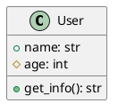
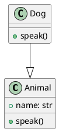

# py2puml - UML Generator for Python

[](https://www.python.org/downloads/)
[](LICENSE)
[](tests/)

**py2puml** - это мощный инструмент для автоматической генерации UML диаграмм из Python исходного кода. Парсер анализирует структуру классов, методов, атрибутов и их взаимосвязей, создавая точные PlantUML диаграммы.

## 🚀 Возможности

- **Полный анализ Python кода**: Парсинг классов, методов, атрибутов и глобальных переменных
- **Генерация PlantUML диаграмм**: Автоматическое создание UML диаграмм в стандартном формате
- **Функция описания файлов**: Анализ и описание отдельных Python файлов с детальным выводом
- **Множественные форматы вывода**: Поддержка текстового, JSON и YAML форматов вывода
- **Извлечение документации**: Извлечение и отображение docstrings из классов, методов и функций
- **Поддержка наследования**: Корректное отображение иерархии классов
- **Управление видимостью**: Различение public, protected и private членов классов
- **Обработка ошибок**: Робастная обработка некорректного кода и проблем файловой системы
- **Визуальная пометка ошибок**: Файлы с ошибками выделяются красным цветом в UML диаграммах
- **Частичный парсинг**: Возможность обработки файлов с синтаксическими ошибками
- **Поддержка типизации**: Анализ type hints и аннотаций типов

## 📊 Пример работы


```bash
# Команда для создания этой диаграммы
python main.py . py2puml.puml
```


## 📋 Требования

- Python 3.8+
- pathspec>=0.11.0 (для поддержки .gitignore паттернов)

## 🛠️ Установка

### Клонирование репозитория
```bash
git clone https://github.com/your-username/py2puml.git
cd py2puml
```

### Установка зависимостей
```bash
# Создание виртуального окружения
python -m venv venv
source venv/bin/activate  # Linux/Mac
# или
venv\Scripts\activate     # Windows

# Установка зависимостей для разработки
pip install -r requirements.txt
```

## 🚀 Быстрый старт

### Базовое использование
```bash
python main.py ./my_python_project ./output/uml_diagram.puml
```

### Функция описания файлов

**Опишите отдельный Python файл:**
```bash
python main.py --describe-file ./src/models.py
```

**Опишите с JSON выводом:**
```bash
python main.py --describe-file ./src/models.py --format json
```

**Опишите с YAML выводом:**
```bash
python main.py --describe-file ./src/models.py --format yaml
```

**Опишите без документации:**
```bash
python main.py --describe-file ./src/models.py --no-docs
```

**Комбинируйте опции:**
```bash
python main.py --describe-file ./src/models.py --format json --no-docs
```

### Примеры использования

**Анализ одного файла:**
```bash
python main.py ./src/models.py ./output/models.puml
```

**Анализ целого проекта:**
```bash
python main.py ./my_project ./output/project_uml.puml
```

**Создание SVG диаграммы:**
```bash
# Генерируем PlantUML файл
python main.py ./my_project ./output/diagram.puml

# Конвертируем в SVG (требует установки PlantUML)
plantuml -tsvg ./output/diagram.puml
```

### Поддержка .gitignore

Инструмент поддерживает паттерны `.gitignore` для исключения файлов из генерации UML:

```bash
# Использовать паттерны .gitignore (по умолчанию)
python main.py ./my_project ./output/diagram.puml

# Отключить паттерны .gitignore
python main.py --no-gitignore ./my_project ./output/diagram.puml
```

#### Примеры

**Базовый .gitignore:**
```
__pycache__/
*.pyc
venv/
```

**Расширенный .gitignore:**
```
# Игнорировать тестовые файлы
tests/
*_test.py

# Игнорировать сгенерированные файлы
*.pyc
__pycache__/

# Игнорировать виртуальные окружения
venv/
.venv/
```

Инструмент автоматически находит все файлы `.gitignore` в проекте и применяет их паттерны относительно местоположения каждого файла, точно так же, как это делает Git.

## 📝 Функция описания файлов

Команда `--describe-file` предоставляет детальный анализ отдельных Python файлов, извлекая классы, функции, переменные и их документацию.

### Форматы вывода

**Текстовый формат (по умолчанию):**
```
File: example.py
Summary: 45 lines, 3 classes, 2 functions, 3 variables

Classes:
  UserAuthenticator (abstract class)
    Bases: ABC
    Documentation: Abstract base class for user authentication.
    Methods:
      + __init__(self, config: Dict[str, str])
        Documentation: Initialize authenticator with configuration.
      + {abstract} authenticate(self, username: str, password: str) -> bool
        Documentation: Authenticate user credentials.

Functions:
  + create_user(username: str, email: str) -> User
    Documentation: Create a new user instance.

Variables:
  + API_VERSION: str
  + DEFAULT_TIMEOUT: int
```

**JSON формат:**
```json
{
  "file": "example.py",
  "summary": {
    "lines": 45,
    "classes": 3,
    "functions": 2,
    "variables": 3
  },
  "classes": [
    {
      "name": "UserAuthenticator",
      "type": "abstract class",
      "bases": ["ABC"],
      "documentation": "Abstract base class for user authentication.",
      "fields": [],
      "methods": [
        {
          "name": "__init__",
          "visibility": "public",
          "signature": "__init__(self, config: Dict[str, str])",
          "return_type": null,
          "documentation": "Initialize authenticator with configuration."
        }
      ]
    }
  ],
  "functions": [
    {
      "name": "create_user",
      "signature": "create_user(username: str, email: str)",
      "return_type": "User",
      "documentation": "Create a new user instance."
    }
  ],
  "variables": [
    {
      "name": "API_VERSION",
      "visibility": "public",
      "type": "str",
      "documentation": null
    }
  ]
}
```

**YAML формат:**
```yaml
file: example.py
summary:
  lines: 45
  classes: 3
  functions: 2
  variables: 3
classes:
  - name: UserAuthenticator
    type: abstract class
    bases: [ABC]
    documentation: Abstract base class for user authentication.
    fields: []
    methods:
      - name: __init__
        visibility: public
        signature: __init__(self, config: Dict[str, str])
        return_type: null
        documentation: Initialize authenticator with configuration.
```

### Поддерживаемые возможности

- **Анализ классов**: Извлекает имена классов, базовые классы, документацию, поля и методы
- **Анализ функций**: Извлекает сигнатуры функций, документацию и типы возвращаемых значений
- **Анализ переменных**: Извлекает глобальные переменные и их типы
- **Извлечение документации**: Извлекает docstrings из классов, методов и функций
- **Определение видимости**: Определяет public, protected и private члены
- **Поддержка async**: Обрабатывает async функции и методы
- **Аннотации типов**: Извлекает type hints и аннотации
- **Обработка ошибок**: Корректно обрабатывает синтаксические ошибки и отсутствующие файлы

### Опции команд

- `--describe-file <file_path>` - Путь к Python файлу для анализа
- `--format {text,json,yaml}` - Формат вывода (по умолчанию: text)
- `--no-docs` - Исключить документацию из вывода

### Примеры использования

**Опишите отдельный Python файл:**
```bash
python main.py --describe-file ./src/models.py
```

**Опишите с JSON выводом:**
```bash
python main.py --describe-file ./src/models.py --format json
```

**Опишите с YAML выводом:**
```bash
python main.py --describe-file ./src/models.py --format yaml
```

**Опишите без документации:**
```bash
python main.py --describe-file ./src/models.py --no-docs
```

**Комбинируйте опции:**
```bash
python main.py --describe-file ./src/models.py --format json --no-docs
```

## 📖 Документация API

### UMLGenerator

Основной класс для генерации UML диаграмм.

#### Конструктор
```python
UMLGenerator(directory_path: str)
```
- `directory_path` - путь к директории с Python файлами

#### Основные методы

**generate_uml() -> str**
Генерирует PlantUML код для всех Python файлов в директории.

**describe_file(file_path: Path, format: str = 'text', include_docs: bool = True) -> str**
Описывает отдельный Python файл с детальным анализом.
- `file_path` - путь к Python файлу для анализа
- `format` - формат вывода: 'text', 'json', или 'yaml'
- `include_docs` - включать ли документацию в вывод
- Возвращает отформатированную строку с анализом файла

**parse_python_file(file_path: Path) -> tuple**
Парсит отдельный Python файл, возвращая кортеж с классами, функциями, глобальными переменными и базовыми классами.

**visibility(name: str) -> tuple**
Определяет видимость члена класса по его имени:
- `__name__` → `~` (magic/private)
- `__name` → `-` (private)
- `_name` → `#` (protected)
- `name` → `+` (public)

### CLI Interface

```bash
python main.py <input_directory> <output_file> [options]
# или
python main.py --describe-file <file_path> [options]
```

**Аргументы:**
- `input_directory` - путь к директории с Python файлами (для генерации UML)
- `output_file` - путь к выходному файлу для сохранения PlantUML кода (для генерации UML)
- `--describe-file <file_path>` - путь к отдельному Python файлу для описания

**Опции для генерации UML:**
- `--use-gitignore` - использовать .gitignore паттерны для исключения файлов (по умолчанию включено)
- `--no-gitignore` - отключить использование .gitignore паттернов

**Опции для описания файлов:**
- `--format {text,json,yaml}` - формат вывода для команды describe-file (по умолчанию: text)
- `--no-docs` - исключить документацию из вывода describe-file

## 🏗️ Архитектура

### Структура проекта
```
py2puml/
├── main.py              # CLI интерфейс
├── uml_generator.py     # Основная логика генерации UML
├── tests/               # Тестовые файлы
│   ├── unit/           # Модульные тесты
│   ├── integration/    # Интеграционные тесты
│   ├── functional/     # Функциональные тесты
│   └── edge_cases/     # Тесты граничных случаев
├── pytest.ini          # Конфигурация pytest
└── README.md           # Документация
```

### Основные компоненты

1. **UMLGenerator** - основной класс для генерации UML
2. **AST Parser** - парсер Python AST для извлечения структурной информации
3. **PlantUML Generator** - генератор PlantUML синтаксиса
4. **Error Handler** - система обработки ошибок и предупреждений
5. **Error Visualization** - система визуального выделения файлов с ошибками

### Алгоритм работы

1. **Сканирование директории** - поиск всех `.py` файлов
2. **Парсинг AST** - анализ структуры каждого файла
3. **Извлечение информации** - классы, методы, атрибуты, наследование
4. **Генерация PlantUML** - создание UML диаграммы
5. **Сохранение результата** - запись в выходной файл

## 🧪 Тестирование

### Запуск тестов

```bash
# Все тесты
pytest

# По категориям
pytest -m unit          # Модульные тесты
pytest -m integration   # Интеграционные тесты
pytest -m functional    # Функциональные тесты
pytest -m edge_cases    # Тесты граничных случаев

# С покрытием
pytest --cov=uml_generator

# Конкретный файл
pytest tests/unit/test_uml_generator.py
```

### Структура тестов

- **Unit Tests** (`tests/unit/`) - тестирование отдельных компонентов и методов
- **Integration Tests** (`tests/integration/`) - тестирование CLI интерфейса и обработки файлов
- **Functional Tests** (`tests/functional/`) - тестирование формата вывода и синтаксиса PlantUML
- **Edge Case Tests** (`tests/edge_cases/`) - тестирование граничных условий и обработки ошибок

### Покрытие тестами

Тестовый набор покрывает:
- ✅ Все публичные методы UMLGenerator
- ✅ Сценарии обработки ошибок
- ✅ Обработку аргументов CLI
- ✅ Операции файловой системы
- ✅ Валидацию вывода PlantUML
- ✅ Граничные случаи и условия

## 📝 Примеры

### Простой класс
```python
class User:
    def __init__(self, name: str, age: int):
        self.name = name
        self._age = age
    
    def get_info(self) -> str:
        return f"{self.name}, {self._age}"
```

Результат:


### Наследование
```python
class Animal:
    def __init__(self, name: str):
        self.name = name
    
    def speak(self):
        pass

class Dog(Animal):
    def speak(self):
        return "Woof!"
```

Результат:


## 🚨 Визуальное представление ошибок

### Пометка файлов с ошибками

py2puml автоматически обнаруживает и визуально выделяет файлы с ошибками в UML диаграммах:

- **Красный цвет**: Файлы с ошибками отображаются красным цветом (`#FF0000`)
- **Комментарии с ошибками**: Список ошибок включается в комментарии к пакету
- **Специальная иконка**: Используется специальная иконка для проблемных файлов

### Пример PlantUML кода для файла с ошибками

```plantuml
package "problematic_file" <<Frame>> #FF0000 {
  note right : Ошибки:
  note right : - Syntax error in line 15
  note right : - Permission denied
  class SomeClass {
    // содержимое класса
  }
}
```

### Типы обрабатываемых ошибок

- **Синтаксические ошибки** (SyntaxError): Неправильный синтаксис Python кода
- **Ошибки доступа** (PermissionError): Отсутствие прав на чтение файлов
- **Ошибки кодировки** (UnicodeDecodeError): Проблемы с кодировкой файлов
- **Общие исключения** (Exception): Любые другие ошибки при обработке

### Доступ к информации об ошибках

```python
generator = UMLGenerator("./my_project")
uml_output = generator.generate_uml()

# Список всех ошибок
print(f"Total errors: {len(generator.errors)}")

# Файлы с ошибками
print(f"Files with errors: {generator.files_with_errors}")

# Конкретный файл
if "path/to/file.py" in generator.files_with_errors:
    errors = generator.files_with_errors["path/to/file.py"]
    print(f"Errors in file: {errors}")
```

## 🔧 Troubleshooting

### Частые проблемы

**Ошибка: "Directory not found"**
```bash
# Убедитесь, что путь к директории корректен
python main.py ./existing_directory ./output.puml
```

**Ошибка: "Permission denied"**
```bash
# Проверьте права доступа к файлам
chmod +r ./your_python_files
```

**Ошибка: "Syntax error"**
- Файлы с синтаксическими ошибками будут пропущены
- Проверьте логи для деталей ошибок
- Файлы с ошибками выделяются красным цветом в UML диаграмме

**Пустой выходной файл**
- Убедитесь, что в директории есть `.py` файлы
- Проверьте, что файлы содержат классы или функции

### Отладка

**Включение подробного вывода:**
```python
# В коде добавьте отладочную информацию
generator = UMLGenerator("./my_project")
print(f"Found errors: {generator.errors}")
print(f"Files with errors: {generator.files_with_errors}")
```

**Проверка структуры проекта:**
```bash
# Убедитесь, что структура корректна
find ./my_project -name "*.py" -type f
```

## 🤝 Contributing

Мы приветствуем вклад в развитие проекта! 

### Как внести вклад

1. **Fork** репозиторий
2. Создайте **feature branch** (`git checkout -b feature/amazing-feature`)
3. **Commit** изменения (`git commit -m 'Add amazing feature'`)
4. **Push** в branch (`git push origin feature/amazing-feature`)
5. Откройте **Pull Request**

### Стандарты кода

- Следуйте PEP 8
- Добавляйте тесты для новой функциональности
- Обновляйте документацию при необходимости
- Используйте type hints

### Структура коммитов

```
feat: добавить новую функциональность
fix: исправить баг
docs: обновить документацию
test: добавить тесты
refactor: рефакторинг кода
```

## 📄 Лицензия

Этот проект распространяется под лицензией MIT. См. файл [LICENSE](LICENSE) для деталей.

## 📞 Поддержка

- **Issues**: [GitHub Issues](https://github.com/your-username/py2puml/issues)
- **Discussions**: [GitHub Discussions](https://github.com/your-username/py2puml/discussions)
- **Email**: your-email@example.com

## 🙏 Благодарности

- [PlantUML](http://plantuml.com/) - за отличный инструмент для генерации UML диаграмм
- [Python AST](https://docs.python.org/3/library/ast.html) - за возможности парсинга Python кода
- Сообществу Python за вдохновение и поддержку

---

**Выполнена инструкция согласно инструменту HOW TO DO**