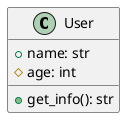
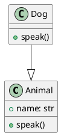

# py2puml - UML Generator for Python

[](https://www.python.org/downloads/)
[](LICENSE)
[](tests/)

**py2puml** - это мощный инструмент для автоматической генерации UML диаграмм из Python исходного кода. Парсер анализирует структуру классов, методов, атрибутов и их взаимосвязей, создавая точные PlantUML диаграммы.

## 🚀 Возможности

- **Полный анализ Python кода**: Парсинг классов, методов, атрибутов и глобальных переменных
- **Генерация PlantUML диаграмм**: Автоматическое создание UML диаграмм в стандартном формате
- **Поддержка наследования**: Корректное отображение иерархии классов
- **Управление видимостью**: Различение public, protected и private членов классов
- **Обработка ошибок**: Робастная обработка некорректного кода и проблем файловой системы
- **Визуальная пометка ошибок**: Файлы с ошибками выделяются красным цветом в UML диаграммах
- **Частичный парсинг**: Возможность обработки файлов с синтаксическими ошибками
- **Поддержка типизации**: Анализ type hints и аннотаций типов

## 📊 Пример работы


```bash
# Команда для создания этой диаграммы
python main.py . py2puml.puml
```


## 📋 Требования

- Python 3.8+
- pathspec>=0.11.0 (для поддержки .gitignore паттернов)

## 🛠️ Установка

### Клонирование репозитория
```bash
git clone https://github.com/your-username/py2puml.git
cd py2puml
```

### Установка зависимостей
```bash
# Создание виртуального окружения
python -m venv venv
source venv/bin/activate  # Linux/Mac
# или
venv\Scripts\activate     # Windows

# Установка зависимостей для разработки
pip install -r requirements.txt
```

## 🚀 Быстрый старт

### Базовое использование
```bash
python main.py ./my_python_project ./output/uml_diagram.puml
```

### Примеры использования

**Анализ одного файла:**
```bash
python main.py ./src/models.py ./output/models.puml
```

**Анализ целого проекта:**
```bash
python main.py ./my_project ./output/project_uml.puml
```

**Создание SVG диаграммы:**
```bash
# Генерируем PlantUML файл
python main.py ./my_project ./output/diagram.puml

# Конвертируем в SVG (требует установки PlantUML)
plantuml -tsvg ./output/diagram.puml
```

### Gitignore Support

The tool supports `.gitignore` patterns to exclude files from UML generation:

```bash
# Use .gitignore patterns (default)
python main.py ./my_project ./output/diagram.puml

# Disable .gitignore patterns
python main.py --no-gitignore ./my_project ./output/diagram.puml
```

#### Examples

**Basic .gitignore:**
```
__pycache__/
*.pyc
venv/
```

**Advanced .gitignore:**
```
# Ignore test files
tests/
*_test.py

# Ignore generated files
*.pyc
__pycache__/

# Ignore virtual environments
venv/
.venv/
```

The tool automatically finds all `.gitignore` files in the project and applies their patterns relative to each file's location, just like Git does.

## 📖 Документация API

### UMLGenerator

Основной класс для генерации UML диаграмм.

#### Конструктор
```python
UMLGenerator(directory_path: str)
```
- `directory_path` - путь к директории с Python файлами

#### Основные методы

**generate_uml() -> str**
Генерирует PlantUML код для всех Python файлов в директории.

**parse_python_file(file_path: Path) -> tuple**
Парсит отдельный Python файл, возвращая кортеж с классами, функциями, глобальными переменными и базовыми классами.

**visibility(name: str) -> tuple**
Определяет видимость члена класса по его имени:
- `__name__` → `~` (magic/private)
- `__name` → `-` (private)
- `_name` → `#` (protected)
- `name` → `+` (public)

### CLI Interface

```bash
python main.py <input_directory> <output_file> [options]
```

**Аргументы:**
- `input_directory` - путь к директории с Python файлами
- `output_file` - путь к выходному файлу для сохранения PlantUML кода

**Опции:**
- `--use-gitignore` - использовать .gitignore паттерны для исключения файлов (по умолчанию включено)
- `--no-gitignore` - отключить использование .gitignore паттернов

## 🏗️ Архитектура

### Структура проекта
```
py2puml/
├── main.py              # CLI интерфейс
├── uml_generator.py     # Основная логика генерации UML
├── tests/               # Тестовые файлы
│   ├── unit/           # Модульные тесты
│   ├── integration/    # Интеграционные тесты
│   ├── functional/     # Функциональные тесты
│   └── edge_cases/     # Тесты граничных случаев
├── pytest.ini          # Конфигурация pytest
└── README.md           # Документация
```

### Основные компоненты

1. **UMLGenerator** - основной класс для генерации UML
2. **AST Parser** - парсер Python AST для извлечения структурной информации
3. **PlantUML Generator** - генератор PlantUML синтаксиса
4. **Error Handler** - система обработки ошибок и предупреждений
5. **Error Visualization** - система визуального выделения файлов с ошибками

### Алгоритм работы

1. **Сканирование директории** - поиск всех `.py` файлов
2. **Парсинг AST** - анализ структуры каждого файла
3. **Извлечение информации** - классы, методы, атрибуты, наследование
4. **Генерация PlantUML** - создание UML диаграммы
5. **Сохранение результата** - запись в выходной файл

## 🧪 Тестирование

### Запуск тестов

```bash
# Все тесты
pytest

# По категориям
pytest -m unit          # Модульные тесты
pytest -m integration   # Интеграционные тесты
pytest -m functional    # Функциональные тесты
pytest -m edge_cases    # Тесты граничных случаев

# С покрытием
pytest --cov=uml_generator

# Конкретный файл
pytest tests/unit/test_uml_generator.py
```

### Структура тестов

- **Unit Tests** (`tests/unit/`) - тестирование отдельных компонентов и методов
- **Integration Tests** (`tests/integration/`) - тестирование CLI интерфейса и обработки файлов
- **Functional Tests** (`tests/functional/`) - тестирование формата вывода и синтаксиса PlantUML
- **Edge Case Tests** (`tests/edge_cases/`) - тестирование граничных условий и обработки ошибок

### Покрытие тестами

Тестовый набор покрывает:
- ✅ Все публичные методы UMLGenerator
- ✅ Сценарии обработки ошибок
- ✅ Обработку аргументов CLI
- ✅ Операции файловой системы
- ✅ Валидацию вывода PlantUML
- ✅ Граничные случаи и условия

## 📝 Примеры

### Простой класс
```python
class User:
    def __init__(self, name: str, age: int):
        self.name = name
        self._age = age
    
    def get_info(self) -> str:
        return f"{self.name}, {self._age}"
```

Результат:


### Наследование
```python
class Animal:
    def __init__(self, name: str):
        self.name = name
    
    def speak(self):
        pass

class Dog(Animal):
    def speak(self):
        return "Woof!"
```

Результат:


## 🚨 Визуальное представление ошибок

### Пометка файлов с ошибками

py2puml автоматически обнаруживает и визуально выделяет файлы с ошибками в UML диаграммах:

- **Красный цвет**: Файлы с ошибками отображаются красным цветом (`#FF0000`)
- **Комментарии с ошибками**: Список ошибок включается в комментарии к пакету
- **Специальная иконка**: Используется специальная иконка для проблемных файлов

### Пример PlantUML кода для файла с ошибками

```plantuml
package "problematic_file" <<Frame>> #FF0000 {
  note right : Ошибки:
  note right : - Syntax error in line 15
  note right : - Permission denied
  class SomeClass {
    // содержимое класса
  }
}
```

### Типы обрабатываемых ошибок

- **Синтаксические ошибки** (SyntaxError): Неправильный синтаксис Python кода
- **Ошибки доступа** (PermissionError): Отсутствие прав на чтение файлов
- **Ошибки кодировки** (UnicodeDecodeError): Проблемы с кодировкой файлов
- **Общие исключения** (Exception): Любые другие ошибки при обработке

### Доступ к информации об ошибках

```python
generator = UMLGenerator("./my_project")
uml_output = generator.generate_uml()

# Список всех ошибок
print(f"Total errors: {len(generator.errors)}")

# Файлы с ошибками
print(f"Files with errors: {generator.files_with_errors}")

# Конкретный файл
if "path/to/file.py" in generator.files_with_errors:
    errors = generator.files_with_errors["path/to/file.py"]
    print(f"Errors in file: {errors}")
```

## 🔧 Troubleshooting

### Частые проблемы

**Ошибка: "Directory not found"**
```bash
# Убедитесь, что путь к директории корректен
python main.py ./existing_directory ./output.puml
```

**Ошибка: "Permission denied"**
```bash
# Проверьте права доступа к файлам
chmod +r ./your_python_files
```

**Ошибка: "Syntax error"**
- Файлы с синтаксическими ошибками будут пропущены
- Проверьте логи для деталей ошибок
- Файлы с ошибками выделяются красным цветом в UML диаграмме

**Пустой выходной файл**
- Убедитесь, что в директории есть `.py` файлы
- Проверьте, что файлы содержат классы или функции

### Отладка

**Включение подробного вывода:**
```python
# В коде добавьте отладочную информацию
generator = UMLGenerator("./my_project")
print(f"Found errors: {generator.errors}")
print(f"Files with errors: {generator.files_with_errors}")
```

**Проверка структуры проекта:**
```bash
# Убедитесь, что структура корректна
find ./my_project -name "*.py" -type f
```

## 🤝 Contributing

Мы приветствуем вклад в развитие проекта! 

### Как внести вклад

1. **Fork** репозиторий
2. Создайте **feature branch** (`git checkout -b feature/amazing-feature`)
3. **Commit** изменения (`git commit -m 'Add amazing feature'`)
4. **Push** в branch (`git push origin feature/amazing-feature`)
5. Откройте **Pull Request**

### Стандарты кода

- Следуйте PEP 8
- Добавляйте тесты для новой функциональности
- Обновляйте документацию при необходимости
- Используйте type hints

### Структура коммитов

```
feat: добавить новую функциональность
fix: исправить баг
docs: обновить документацию
test: добавить тесты
refactor: рефакторинг кода
```

## 📄 Лицензия

Этот проект распространяется под лицензией MIT. См. файл [LICENSE](LICENSE) для деталей.

## 📞 Поддержка

- **Issues**: [GitHub Issues](https://github.com/your-username/py2puml/issues)
- **Discussions**: [GitHub Discussions](https://github.com/your-username/py2puml/discussions)
- **Email**: your-email@example.com

## 🙏 Благодарности

- [PlantUML](http://plantuml.com/) - за отличный инструмент для генерации UML диаграмм
- [Python AST](https://docs.python.org/3/library/ast.html) - за возможности парсинга Python кода
- Сообществу Python за вдохновение и поддержку

---

**Выполнена инструкция согласно инструменту HOW TO DO**