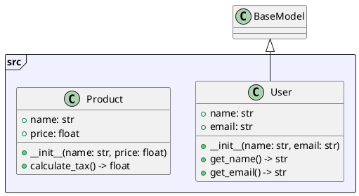

# py2puml - UML Generator for Python

[](https://www.python.org/downloads/)
[](LICENSE)
[](tests/)

**py2puml** - это мощный инструмент для автоматической генерации UML диаграмм из Python исходного кода. Парсер анализирует структуру классов, методов, атрибутов и их взаимосвязей, создавая точные PlantUML диаграммы.

## 📋 Содержание

- [🚀 Возможности](#-возможности)
- [📊 Пример работы](#-пример-работы)
- [📋 Требования](#-требования)
- [🛠️ Установка](#️-установка)
  - [Клонирование репозитория](#клонирование-репозитория)
  - [Установка зависимостей](#установка-зависимостей)
  - [Установка с MCP сервером (Опционально)](#установка-с-mcp-сервером-опционально)
- [🚀 Быстрый старт](#-быстрый-старт)
  - [Базовое использование](#базовое-использование)
  - [Различные способы запуска](#различные-способы-запуска)
  - [Функция описания файлов](#функция-описания-файлов)
  - [Продвинутое использование](#продвинутое-использование)
- [📖 Примеры использования](#-примеры-использования)
- [🔧 Разработка](#-разработка)
- [📝 Возможности подробно](#-возможности-подробно)
- [📄 Лицензия](#-лицензия)

## 🚀 Возможности

- **Полный анализ Python кода**: Парсинг классов, методов, атрибутов и глобальных переменных
- **Генерация PlantUML диаграмм**: Автоматическое создание UML диаграмм в стандартном формате
- **Функция описания файлов**: Анализ и описание отдельных Python файлов с детальным выводом
- **Множественные форматы вывода**: Поддержка текстового, JSON и YAML форматов вывода
- **Извлечение документации**: Извлечение и отображение docstrings из классов, методов и функций
- **Поддержка наследования**: Корректное отображение иерархии классов
- **Управление видимостью**: Различение public, protected и private членов классов
- **Обработка ошибок**: Робастная обработка некорректного кода и проблем файловой системы
- **Визуальная пометка ошибок**: Файлы с ошибками выделяются красным цветом в UML диаграммах
- **Частичный парсинг**: Возможность обработки файлов с синтаксическими ошибками
- **Поддержка типизации**: Анализ type hints и аннотаций типов
- **Современная CLI архитектура**: Командный интерфейс с четким разделением ответственности
- **Интеграция с MCP сервером**: Опциональный MCP (Model Context Protocol) сервер для улучшенной интеграции с IDE Cursor

## 📊 Пример работы

```bash
# Команда для создания этой диаграммы
py2puml generate . py2puml.puml
```


## 📋 Требования

- Python 3.8+
- pathspec>=0.11.0 (для поддержки .gitignore паттернов)
- PyYAML>=6.0 (для YAML формата вывода)

## 🛠️ Установка

### Клонирование репозитория
```bash
git clone https://github.com/your-username/py2puml.git
cd py2puml
```

### Установка зависимостей
```bash
# Создание виртуального окружения
python -m venv venv
source venv/bin/activate  # Linux/Mac
# или
venv\Scripts\activate     # Windows

# Установка в режиме разработки
pip install -e .
```

### Установка с MCP сервером (Опционально)

Для улучшенной интеграции с IDE Cursor можно установить MCP (Model Context Protocol) сервер:

```bash
# Базовая установка с MCP сервером
./install.sh --install-mcp

# Установка с MCP сервером и настройкой Cursor
./install.sh --install-mcp --configure-cursor
```

MCP сервер предоставляет детальный анализ структуры Python файлов агенту Cursor, обеспечивая лучшее понимание кода и генерацию документации.

## 🚀 Быстрый старт

### Базовое использование

**Генерация UML диаграммы из директории:**
```bash
py2puml generate ./my_python_project ./output/uml_diagram.puml
```

**Описание отдельного Python файла:**
```bash
py2puml describe ./src/models.py
```

### Различные способы запуска
py
**После установки (рекомендуется):**
```bash
py2puml generate src/ output.puml
py2puml describe src/models.py
```

**Прямое выполнение:**
```bash
python cli_direct.py generate src/ output.puml
python cli_direct.py describe src/models.py
```

### Функция описания файлов

**Описание с JSON выводом:**
```bash
py2puml describe ./src/models.py --format json
```

**Описание с YAML выводом:**
```bash
py2puml describe ./src/models.py --format yaml
```

**Описание без документации:**
```bash
py2puml describe ./src/models.py --no-docs
```

**Комбинирование опций:**
```bash
py2puml describe ./src/models.py --format json --no-docs
```

### Продвинутое использование

**Генерация без фильтрации .gitignore:**
```bash
py2puml generate ./src/ ./output/diagram.puml --no-gitignore
```

**Генерация с явным использованием .gitignore:**
```bash
py2puml generate ./src/ ./output/diagram.puml --use-gitignore
```

## 📖 Примеры использования

### Анализ одного файла
```bash
py2puml describe ./src/models.py
```

**Вывод:**
```
File: ./src/models.py
Summary: 45 lines, 3 classes, 2 functions, 1 variables

Classes:
  User (class)
    Bases: BaseModel
    Methods:
      public + __init__(name: str, email: str)
      public + get_name() -> str
      public + get_email() -> str

  Product (class)
    Methods:
      public + __init__(name: str, price: float)
      public + calculate_tax() -> float

Functions:
  public + create_user(name: str, email: str) -> User

Variables:
  public DEFAULT_SETTINGS
```

### Анализ с JSON выводом
```bash
py2puml describe ./src/models.py --format json
```

**Вывод:**
```json
{
  "file": "./src/models.py",
  "summary": {
    "lines": 45,
    "classes": 3,
    "functions": 2,
    "variables": 1
  },
  "classes": [
    {
      "name": "User",
      "type": "class",
      "bases": ["BaseModel"],
      "methods": [
        {
          "name": "__init__",
          "visibility": "public",
          "signature": "+ __init__(name: str, email: str)"
        }
      ]
    }
  ]
}
```

### Генерация UML диаграммы
```bash
py2puml generate ./src/ ./output/diagram.puml
```

**Сгенерированный PlantUML:**


## 🔧 Разработка

### Запуск тестов
```bash
python -m pytest
```

### Запуск с покрытием
```bash
python -m pytest --cov=core --cov=utils
```

### Установка для разработки
```bash
pip install -e .
```

## 📝 Детальное описание возможностей

### Анализ классов
- **Наследование**: Обнаруживает и отображает иерархии классов
- **Методы**: Анализирует сигнатуры методов с type hints
- **Атрибуты**: Определяет атрибуты классов и их типы
- **Видимость**: Различает public (+), protected (#) и private (-) члены
- **Документация**: Извлекает и отображает docstrings

### Анализ функций
- **Глобальные функции**: Анализирует функции вне классов
- **Type hints**: Обрабатывает аннотации параметров и возвращаемых типов
- **Документация**: Извлекает docstrings функций
- **Видимость**: Все глобальные функции считаются public

### Обработка ошибок
- **Синтаксические ошибки**: Корректно обрабатывает файлы с синтаксическими ошибками
- **Ошибки импорта**: Продолжает обработку несмотря на проблемы импорта
- **Ошибки файловой системы**: Обрабатывает проблемы доступа и разрешений
- **Визуальная обратная связь**: Файлы с ошибками помечаются красным в UML диаграммах

### Форматы вывода
- **Text**: Человекочитаемый формат с детальной информацией
- **JSON**: Структурированные данные для программной обработки
- **YAML**: Альтернативный структурированный формат
- **PlantUML**: Стандартный формат UML диаграмм

## 📄 Лицензия

Этот проект лицензирован под MIT License - см. файл [LICENSE](LICENSE) для деталей.